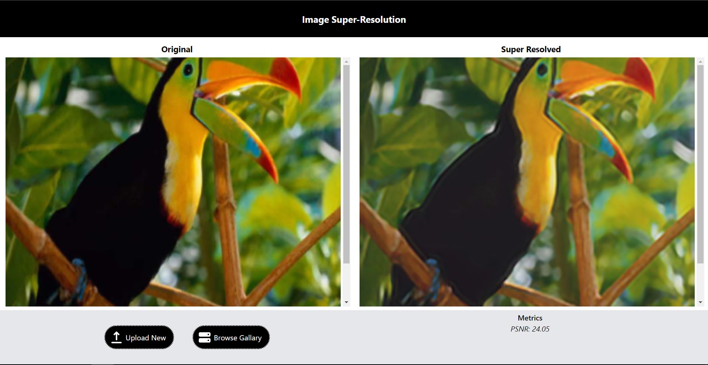

# Web Server for Image Super-Resolution
This project showcases the Super-Resolution CNN (SRCNN). The model is pretrained following 
<a href="https://debuggercafe.com/image-super-resolution-using-deep-learning-and-pytorch/" target="_blank">this tutorial</a>.
The original paper can be found <a href="https://arxiv.org/pdf/1501.00092.pdf" target="_blank">here</a>.



## System Requirements
Linux system with npm 6+ and Python 3.8+

## Build
To configure backend dependencies, execute the `build.sh` script
```
./build.sh
```

## Server Start and Shutdown
To start the server and the UI, first execute the backend startup script, then launch the frontend
```
cd backend
./startup.sh
cd ../frontend
npm run dev
```
The frontend is accessible through `localhost:3000`

### Note: 
The frontend and the backend are hosted seperately, the backend is hosted at `localhost:8888`

To stop the server, firsts shutdown the frontend, then execute the backend shutdown script
```
cd backend
./shutdown.sh
```

## Issues
- Image sizing, responsive scaling and scrolling not as expected
- Websocket connection crashes upon large image upload

## Reference
https://arxiv.org/pdf/1501.00092.pdf